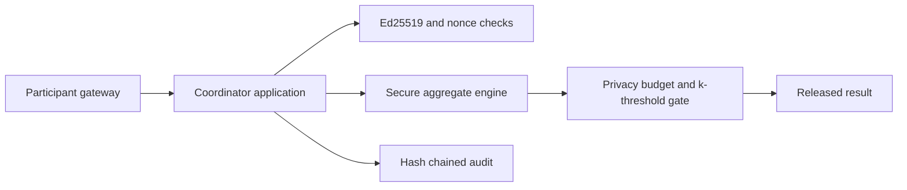

# Federated Analytics Coordinator

Pure Go coordination service for privacy-preserving aggregate tasks. The coordinator receives signed aggregate shares, never raw participant records, and releases results only after participant threshold, task state, overflow, and privacy-budget checks.

## Implemented

- Tenant-scoped participant and Ed25519 public-key registration.
- Capability negotiation for count, mean, histogram, quantile and gradient templates.
- Task lifecycle: `draft -> collecting -> masked -> aggregating -> revealing -> completed`, with abort from every active phase.
- Signed share validation, nonce replay protection, duplicate participant protection, int64 overflow checks and deterministic participant ordering.
- Privacy budget reservation/commit/release and result release metadata.
- Hash-chained audit entries and operator abort records.
- Health/readiness, pprof, bounded JSON requests and graceful shutdown.

The default store is process memory for deterministic local verification. The repository boundary is ready for encrypted PostgreSQL/object-storage adapters; the service does not claim durability until one is wired in.

## Run

```sh
cp .env.example .env
go run ./cmd/coordinator
curl -H 'X-Tenant-ID: demo' http://localhost:8081/healthz
```

## Architecture



No arbitrary scripts execute in the service. Secret shares are represented as fixed-point signed integers; cryptographic implementations must zero temporary key material and use mTLS at the deployment edge. See `docs/architecture.md` and `api/openapi/openapi.yaml` for the data model and threat model.
